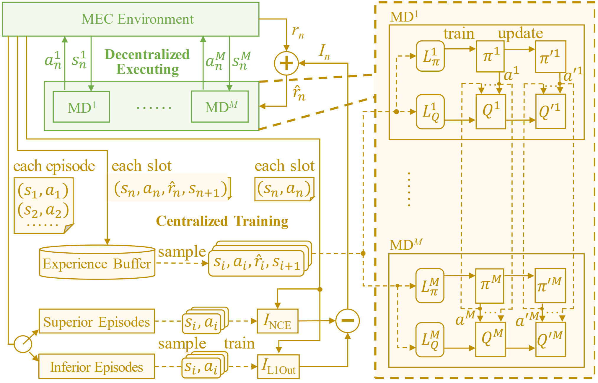
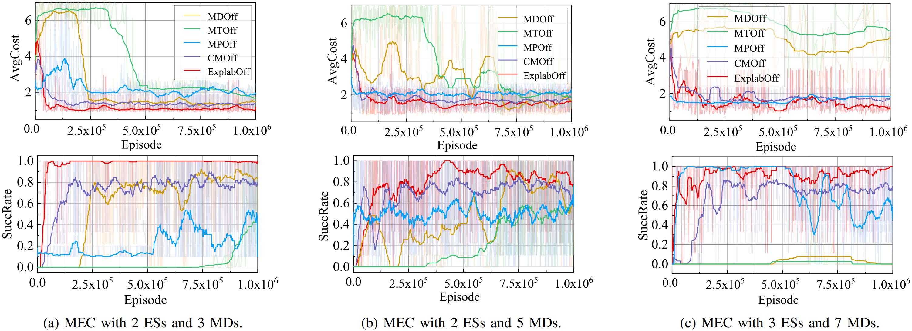

# ExplabOff
ExplabOff: Towards Explorative and Collaborative Task Offloading via Mutual Information-Enhanced MARL

## Abstract

Multi-access edge computing provides mobile devices (MDs) with both satisfactory computing resources and task latency, by offloading MDs’ tasks to nearby edge servers. There is a popular trend to develop decentralized offloading (dec-offloading) approaches using multi-agent reinforcement learning (MARL), primarily based on centralized-training and decentralized-execution. However, the dec-offloading policies together could also lack exploration and collaboration since each MD is guided by the policy-critic only through offloading costs without explicitly considering the impacts of other MDs’ offloading behaviors. Motivated by this, we propose Explorative and collaborative Offloading (ExplabOff) that can achieve superior dec-offloading by consciously exploiting the implicit exploration and collaboration information involved in MDs’ states and actions. Specifically, we design two additional policy-learning metrics, the exploration-metric based on the maximum entropy of MDs’ joint offloading actions and collaboration-metric based on one MD’s belief about others’ offloading behaviors. Then, we assemble these metrics into a new criterion defined as the mutual information (MI) between MDs’ states and actions, and adopt it as an additive reward except for the vanilla reward during centralized-training. Furthermore, we distinguish MI between superior and inferior offloading, strengthening and weakening them discriminatively. Experiments on both simulation and real-testbed verify the effectiveness of ExplabOff over state-of-the-art dec-offloading.

## Method
<p align="center">
  <br><br>
</p>
<p align="center"> The algorithm overview of ExplabOff. </p>

<p align="center">
  <br><br>
</p>
<p align="center">Performance comparison between different MARL-based offloading methods. </p>

## Usage:
To train Explaboff:
```bash
python -u run_mec_offloading_alg.py  --MI_update_freq=1 --min_adv_c=1 --max_adv_c=3.5  --env_name=mec_env  --policy_name=MA_MINE_DDPG --seed=4 --gpu-no=1 --id Explaboff
```
To train MDOff:
```bash
python baselines/offpolicy/scripts/train/train_mpe.py --env_name "MEC" --algorithm_name "maddpg" --experiment_name "test" --scenario_name "MEC_multi" --seed 2 --actor_train_interval_step 1 --episode_length 25 --use_soft_update --lr 7e-4 --hard_update_interval_episode 200 --num_env_steps 10000000 --id MDOff
```
To train CMOff:
```bash
python -u run_coma_like_offloading_alg.py  --MI_update_freq=1  --env_name=mec_env  --policy_name=MA_MINE_DDPG --seed=1 --gpu-no=0 --id CMOff 
```
To train MPOff:
```bash
python baselines/onpolicy/scripts/train_mpe.py --use_valuenorm --use_popart --env_name 'MEC' --algorithm_name 'mappo' --experiment_name "test" --scenario_name "MEC_multi" --num_agents 3 --seed 0 --n_training_threads 1 --n_rollout_threads 1 --num_mini_batch 1 --episode_length 25 --num_env_steps 20000000 --ppo_epoch 10 --use_ReLU --gain 0.01 --lr 7e-4 --critic_lr 7e-4 --user_name "marl" --id MPOff
```

To train MTOff:
```bash
python baselines/offpolicy/scripts/train/train_mpe.py --env_name "MEC" --algorithm_name "matd3" --experiment_name "test" --scenario_name "MEC_multi" --seed 0 --actor_train_interval_step 1 --episode_length 25 --use_soft_update --lr 7e-4 --hard_update_interval_episode 200 --num_env_steps 10000000 --id MTOff
```